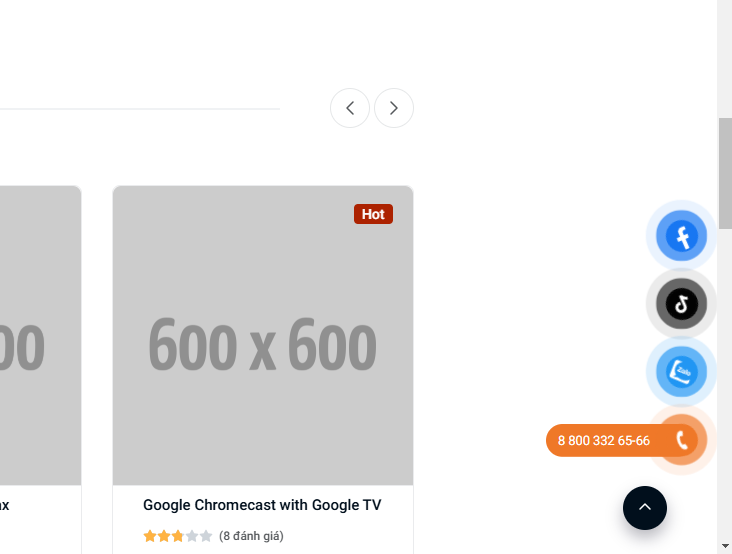
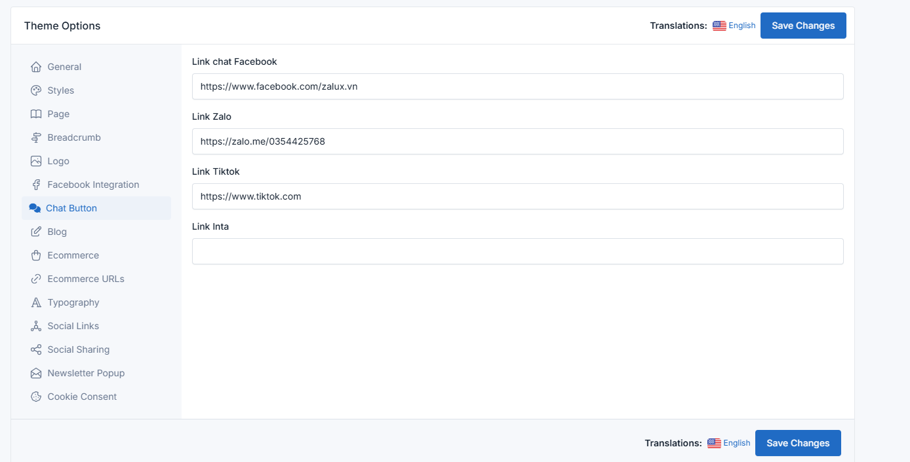

# Popup Chat Icon for ACTCMS

Popup Chat Button is a plugin for ACTCMS. It allows you to add a floating button chat to your
website.

## Requirements

- ACTCMS core 1.0.0 or higher.

## Installation

**Install via Admin Panel**

Go to the **Admin Panel** and click on the **Plugins** tab. Click on the "Add new" button, find the **Popup Chat** plugin and click on the "Install" button.

**Install manually**

1. Download the plugin from
   the [ACTCMS](https://actcms.io.vn/)
2. Extract the downloaded file and upload the extracted folder to the `platform/plugins` directory.
3. Go to **Admin** > **Plugins** and click on the **Activate** button.

## Usage

First, you need to go to **Admin** -> **Theme Options** -> **Chat Button** tab to set up your information.

!

## License

The MIT License (MIT). Please see [License File](LICENSE) for more information.
